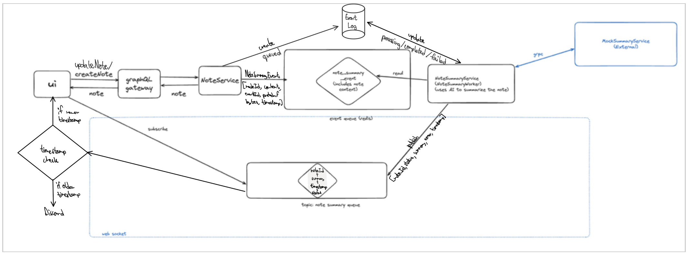
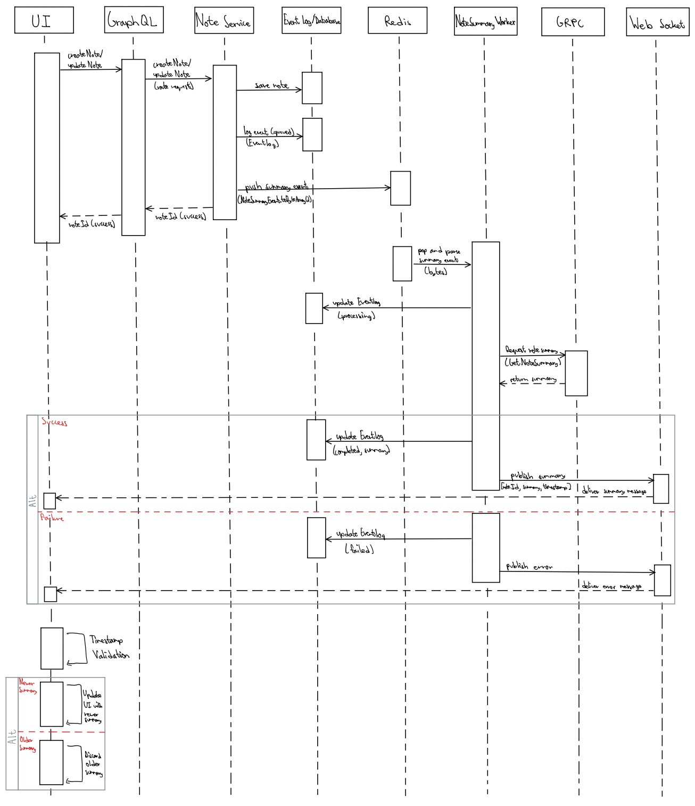

# Project 2: Concurrent Notes RFC

## 1. System Diagram

## 2. gRPC vs. GraphQL vs. REST Tradeoffs
For this architecture, I specifically chose different communication protocols depending on which parts of the system were talking to each other. To connect the Next.js frontend to the core Note Service, I used a GraphQL Gateway. As discussed in the lectures, GraphQL is the best choice here because it lets the frontend ask for the exact pieces of data it needs to display the notes, preventing us from getting too much or too little information like REST tends to do. I also decided against standard REST for this client-facing connection because REST forces you to hit fixed endpoints that return bulky and preset blocks of text data. That would have forced the UI to either download extra data it doesn't even use or make multiple round-trip network requests just to load a single page. I also ruled out gRPC for the frontend because web browsers have a really hard time reading and working with its strict binary format. The main tradeoff I had to accept with GraphQL is that since all requests go through a single URL, we lose the easy, built-in caching that comes with standard REST.

On the other hand, for the internal connection between the Note Summary Worker and the external Mock Summary Service, I strictly enforced a gRPC boundary. For backend-to-backend communication, gRPC is better because it converts the information into lightweight and packed binary data before sending it over the network (which I showed as a conversion step in my diagrams). This binary format makes the network calls extremely fast. I didn't use REST for this internal connection because translating data into heavy, readable text takes extra time and adds unnecessary delays when these two servers just need to pass raw data back and forth. I also avoided GraphQL here because giving a client the flexibility to choose its data shape seems useless in a strict server-to-server transaction where the data structure (which is just the note content and the resulting summary) is already permanently fixed. The tradeoff I made for getting gRPC's speed is that we have to maintain strict rules for the data shape, and we lose the human-readability that makes REST APIs so easy to test.

## 3. The Race Condition
To manage the tricky timing issues of a system where tasks happen in the background, I had to design a way to handle race conditions. The fake external summary service takes a few seconds to respond, which means a user could edit a note twice really fast. If the first summary takes longer to generate than the second one, the older, outdated summary might arrive at the screen last and overwrite the newer one. To show how my timestamp guard prevents stale data from appearing in the UI, here is the exact scenario where Event A (an old edit) finishes after Event B (a new edit):

- **First step:** The user makes an older edit, which we will call Event A. The Note Service saves it and logs the event as queued. Immediately after, the user makes a newer edit, Event B, which also gets saved and queued.
- **Second step:** The Note Summary Worker pops both events from Redis and sends them to the Mock Summary Service. The external service simulates a random delay, so Event B manages to finish generating its summary before Event A.
- **Third step:** The worker publishes Event B to the WebSocket. As my system diagram shows, it sends an array containing the note ID, status, the summary text, any errors, and the exact timestamp of when the edit happened.
- **Fourth step:** The UI receives Event B and hits the "Timestamp Validation" guard. The frontend checks the time and sees that Event B is newer than what it currently has, so it updates the UI with the new summary.
- **Fifth step:** The delayed Event A finally finishes processing in the background. The worker sends Event A's summary through the WebSocket, which is complete with its older timestamp.
- **Sixth step:** The UI receives Event A and runs the timestamp check again. It compares Event A's timestamp against the current one on the screen. Event A is older, so the UI triggers the "Discard older" logic and safely throws the stale data away, protecting the screen from showing outdated information.

Aside from just the timing issues, I also needed a way to keep track of what was actually happening behind the scenes. These background tasks take time and rely on an external server, so I used an Event Log database. As soon as the user saves a note, the main Note Service logs that a summary request is queued. Then, as the background worker picks up the job, it updates the database to say the job is processing. Finally, depending on what the external service sends back, the worker updates the log one last time to either completed or failed. This gives the system a clear history of exactly where every single summary request is in the pipeline.

## 4. Sequence Diagram

